# EV1 ABS validation — engineering report

_Generated 2026-05-02 00:41 by `scripts/abs_report.py`._

This report aggregates the four standard ABS validation
scenarios.  Each scenario gets its own section with setup,
numerical result tables, and a stack of charts: vehicle
speed, per-wheel ground speed, slip ratios, ABS phase
timeline, yaw rate, and (for `split_mu`) trajectory.

Source data: `/tmp/ev1sim_abs_<test>/{summary.txt,
abs_btcm_{on,off}.csv}`.  Refresh with
`for t in high_mu low_mu mu_jump split_mu; do ./scripts/run_abs_compare.sh $t; done` and re-run this
script.

## Headline table

| Test | BTCM-on stop | BTCM-off stop | Δ stop dist | ABS events FL/FR | yaw drift (on / off) |
|---|---|---|---:|---:|---|
| high_mu | 149.95 m / 9.89 s | 148.52 m / 9.47 s | +1.4 m | 77 / 66 | +0.24° / +0.07° |
| low_mu | didn't stop, v\_f = 2.91 m/s | didn't stop, v\_f = 1.57 m/s | — | 149 / 132 | -0.25° / +3.54° |
| mu_jump | didn't stop, v\_f = 4.10 m/s | didn't stop, v\_f = 3.65 m/s | — | 248 / 149 | -1.03° / -1.00° |
| split_mu | 74.10 m / 7.01 s | 72.49 m / 6.53 s | +1.6 m | 72 / 78 | +0.02° / +0.09° |

Δ stop dist > 0 means BTCM-on took *longer* than BTCM-off.
Yaw drift > 0 = car rotated counter-clockwise (toward driver
left).  On `split_mu` the car drifts toward the asphalt side
(positive in our coordinate frame).

## `high_mu`

### Setup

| Field | Value |
|---|---|
| Surface | uniform asphalt (μ ≈ 0.9) |
| Approach | throttle to ≥ 30 m/s, throttle off, full brake |
| Brake fires | scenario t = 6 s |
| Validates | ABS should mostly stay quiet; wheel lock on dry asphalt is rare |

### Result summary (BTCM-on vs BTCM-off)

| Metric | BTCM-on | BTCM-off |
|---|---|---|
| Brake-on at | t = 14.10 s, v = 30.06 m/s | t = 14.10 s, v = 30.06 m/s |
| Stop result | 149.95 m / 9.89 s | 148.52 m / 9.47 s |
| FL events | 77 | 0 |
| FR events | 66 | 0 |
| Yaw drift over brake | +0.24° | +0.07° |

### Per-wheel slip statistics (BTCM-on)

| Wheel | peak | mean | time-locked |
|---|---:|---:|---:|
| FL | 0.708 | 0.064 | 0.0% |
| FR | 0.639 | 0.065 | 0.0% |
| RL | 0.851 | 0.068 | 0.0% |
| RR | 0.794 | 0.068 | 0.0% |

### Front ABS phase distribution during brake event (BTCM-on)

| Wheel | APPLY | HOLD | DUMP | stale | phase transitions |
|---|---:|---:|---:|---:|---:|
| FL | 24.6% | 6.7% | 13.7% | 55.0% | 89 |
| FR | 21.1% | 7.3% | 13.7% | 57.9% | 81 |

### Charts

**[▶ Animated top-down replay (open in browser)](abs_scenarios.charts/high_mu_replay.html)** — watch the car drive through the brake event with per-wheel slip color-coded, surface patches drawn behind, and a scrubbable timeline.  Toggle BTCM-on / BTCM-off in the dropdown to A/B the same instant.

**Vehicle speed**

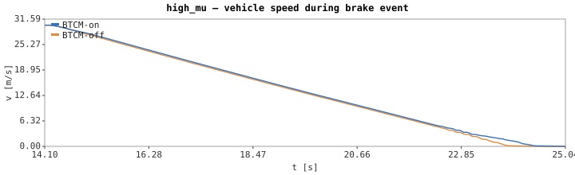

**Effective brake force at each axle.**  Front solid,
rear dashed.  Front line is `applied_front_brake` directly
(the post-ABS-modulation ratio fed to Chrono).  Rear line
is *derived* from `emb_cmd_lr/rr`: max(0, cmd) averaged
across L and R, because the CSV's `applied_rear_brake`
captures the *symmetric* driver-pedal command rather than
the per-wheel override that `ApplyRearEmbBrake` feeds into
Chrono.  BTCM-off rear is forced to 0 here — the EV1's
rear EMB has no hydraulic backup line, so when the
controller is out of the loop the rear free-rolls.

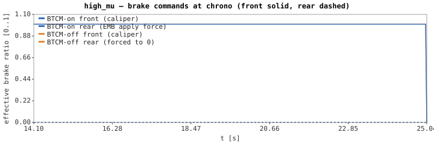

**Front ABS phase timeline (hydraulic axle).**  Discrete
APPLY/HOLD/DUMP solenoid bands.  See the rear EMB chart
just below for the *equivalent* rear-axle modulation —
same algorithm decisions, different actuator (continuous
motor command in [-1, +1] instead of solenoid phases).

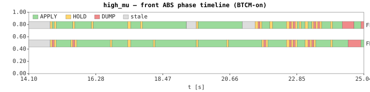

**Rear EMB motor command (electromechanical axle).** Continuous-valued analog of the front Gantt above. `+1` = motor pushing apply, `-1` = motor releasing the shoes, `~0` = hold position.

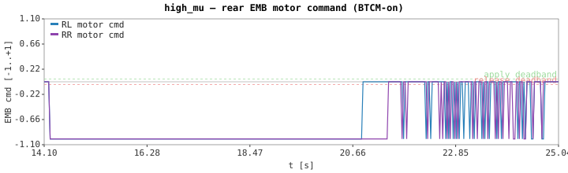

**Command vs actual actuator state.**  Solid lines are
commands sent to Chrono; dashed lines are the modeled
post-actuator-lag values (caliper hydraulic τ ≈ 50 ms
apply / 80 ms release; rear shoe rate-limited at ~3.33/s).
Useful for understanding why ABS modulation looks blunt
on the speed chart — the actuator lag smooths the rapid
HOLD↔DUMP cycling into a slower-changing pressure curve.

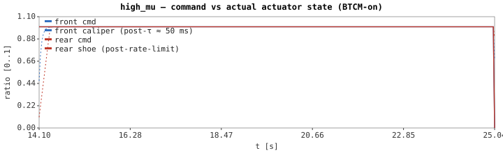

**Per-wheel ground speed** (chassis line + 4 wheel lines).  Gap = slip.

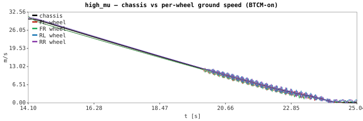

**Slip ratios.**  Threshold reference lines at 0.05 and
0.15 mark the algorithm's exit / enter slip thresholds.
Note the chassis-side slip values are *raw tire-contact*
data from Chrono's TMeasy model and look noisier than a
real ABS would see — production ABS heavily filters this
(typically a 10–30 ms low-pass), and our firmware's own
perception of slip (derived from tone-ring counts over
50 ms windows) is naturally smoother.  The peaks here
show what the *tire* is actually doing instant-to-
instant; the firmware's view is a window-average.

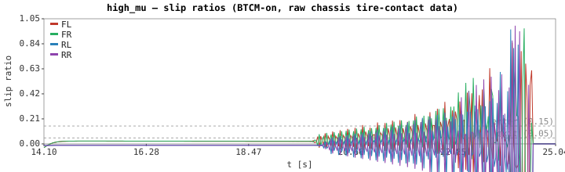

**Yaw rate.**  Positive = counter-clockwise rotation.

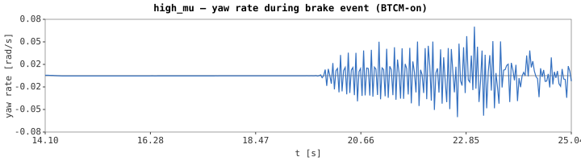

**BTCM firmware internal view.**  What the AVR's ABS
algorithm *thinks* is happening, sampled from the
firmware's `abs_controller_t` state via the host-side
`BTCM_CSV_LOG` snapshot.  Black = chassis truth (ev1sim);
blue = firmware's own `vehicle_speed_mps` reference;
colored = firmware's per-wheel ground speed (rps × tire
radius).  Time axis aligned to BTCM's brake-on event so
t=0 here matches t=0 in the chassis charts above.
Divergences between chassis truth and firmware view
show where the ABS algorithm's perception is wrong.

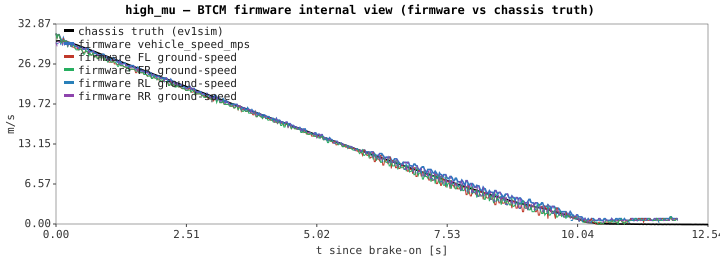

**BTCM-side accelerometer reading.**  The host bridge
publishes longitudinal accel onto the chassis bus and
pokes it into `g_host_sensors` even when the firmware's
ABS algorithm doesn't consume it (build-time gated by
`BTCM_USE_ACCELEROMETER`, default OFF to match original
EV1).  Useful for understanding what a second-gen ABS
would see if the firmware was rebuilt with the gate on.

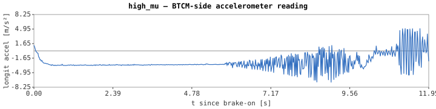

## `low_mu`

### Setup

| Field | Value |
|---|---|
| Surface | uniform ice (μ ≈ 0.10) |
| Approach | throttle to ≥ 15 m/s, throttle off, full brake |
| Brake fires | scenario t = 7 s |
| Validates | wheels lock easily; ABS should modulate and keep wheels rolling |

### Result summary (BTCM-on vs BTCM-off)

| Metric | BTCM-on | BTCM-off |
|---|---|---|
| Brake-on at | t = 38.29 s, v = 15.01 m/s | t = 38.29 s, v = 15.01 m/s |
| Stop result | didn't stop, v\_f = 2.91 m/s | didn't stop, v\_f = 1.57 m/s |
| FL events | 149 | 0 |
| FR events | 132 | 0 |
| Yaw drift over brake | -0.25° | +3.54° |

### Per-wheel slip statistics (BTCM-on)

| Wheel | peak | mean | time-locked |
|---|---:|---:|---:|
| FL | 1.000 | 0.467 | 38.2% |
| FR | 1.000 | 0.475 | 39.4% |
| RL | 0.437 | 0.065 | 0.0% |
| RR | 0.419 | 0.062 | 0.0% |

### Front ABS phase distribution during brake event (BTCM-on)

| Wheel | APPLY | HOLD | DUMP | stale | phase transitions |
|---|---:|---:|---:|---:|---:|
| FL | 47.8% | 11.9% | 6.1% | 34.2% | 149 |
| FR | 47.4% | 9.9% | 5.0% | 37.7% | 131 |

### Charts

**[▶ Animated top-down replay (open in browser)](abs_scenarios.charts/low_mu_replay.html)** — watch the car drive through the brake event with per-wheel slip color-coded, surface patches drawn behind, and a scrubbable timeline.  Toggle BTCM-on / BTCM-off in the dropdown to A/B the same instant.

**Vehicle speed**

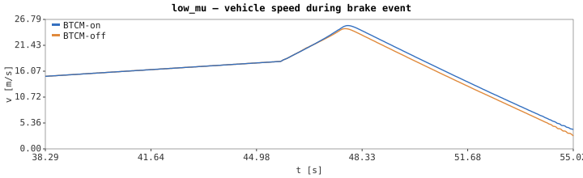

**Effective brake force at each axle.**  Front solid,
rear dashed.  Front line is `applied_front_brake` directly
(the post-ABS-modulation ratio fed to Chrono).  Rear line
is *derived* from `emb_cmd_lr/rr`: max(0, cmd) averaged
across L and R, because the CSV's `applied_rear_brake`
captures the *symmetric* driver-pedal command rather than
the per-wheel override that `ApplyRearEmbBrake` feeds into
Chrono.  BTCM-off rear is forced to 0 here — the EV1's
rear EMB has no hydraulic backup line, so when the
controller is out of the loop the rear free-rolls.

**Front ABS phase timeline (hydraulic axle).**  Discrete
APPLY/HOLD/DUMP solenoid bands.  See the rear EMB chart
just below for the *equivalent* rear-axle modulation —
same algorithm decisions, different actuator (continuous
motor command in [-1, +1] instead of solenoid phases).

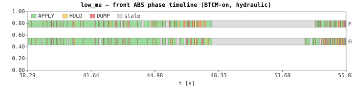

**Rear EMB motor command (electromechanical axle).** Continuous-valued analog of the front Gantt above. `+1` = motor pushing apply, `-1` = motor releasing the shoes, `~0` = hold position.

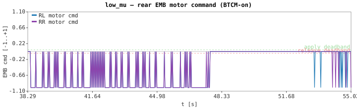

**Command vs actual actuator state.**  Solid lines are
commands sent to Chrono; dashed lines are the modeled
post-actuator-lag values (caliper hydraulic τ ≈ 50 ms
apply / 80 ms release; rear shoe rate-limited at ~3.33/s).
Useful for understanding why ABS modulation looks blunt
on the speed chart — the actuator lag smooths the rapid
HOLD↔DUMP cycling into a slower-changing pressure curve.

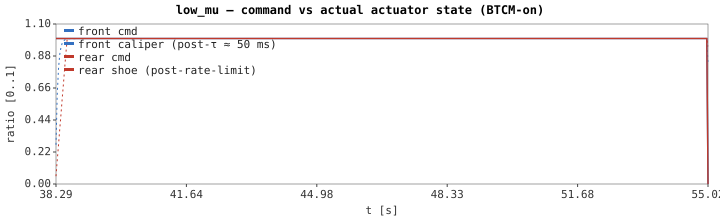

**Per-wheel ground speed** (chassis line + 4 wheel lines).  Gap = slip.

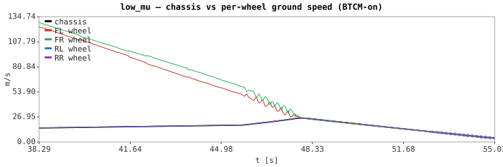

**Slip ratios.**  Threshold reference lines at 0.05 and
0.15 mark the algorithm's exit / enter slip thresholds.
Note the chassis-side slip values are *raw tire-contact*
data from Chrono's TMeasy model and look noisier than a
real ABS would see — production ABS heavily filters this
(typically a 10–30 ms low-pass), and our firmware's own
perception of slip (derived from tone-ring counts over
50 ms windows) is naturally smoother.  The peaks here
show what the *tire* is actually doing instant-to-
instant; the firmware's view is a window-average.

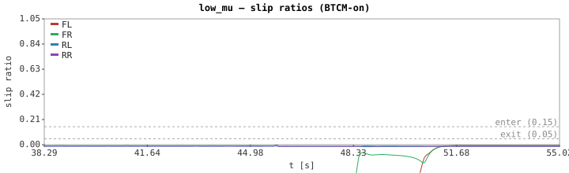

**Yaw rate.**  Positive = counter-clockwise rotation.

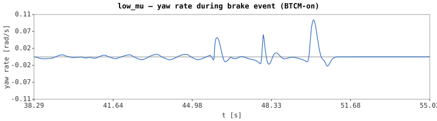

**BTCM firmware internal view.**  What the AVR's ABS
algorithm *thinks* is happening, sampled from the
firmware's `abs_controller_t` state via the host-side
`BTCM_CSV_LOG` snapshot.  Black = chassis truth (ev1sim);
blue = firmware's own `vehicle_speed_mps` reference;
colored = firmware's per-wheel ground speed (rps × tire
radius).  Time axis aligned to BTCM's brake-on event so
t=0 here matches t=0 in the chassis charts above.
Divergences between chassis truth and firmware view
show where the ABS algorithm's perception is wrong.

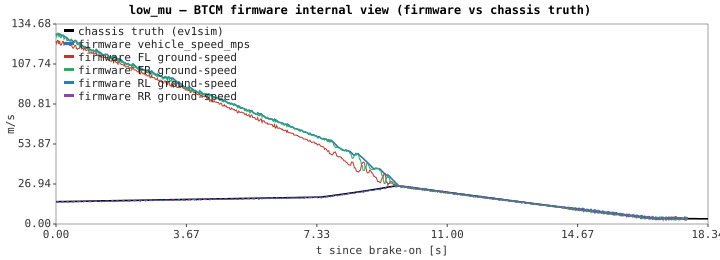

**BTCM-side accelerometer reading.**  The host bridge
publishes longitudinal accel onto the chassis bus and
pokes it into `g_host_sensors` even when the firmware's
ABS algorithm doesn't consume it (build-time gated by
`BTCM_USE_ACCELEROMETER`, default OFF to match original
EV1).  Useful for understanding what a second-gen ABS
would see if the firmware was rebuilt with the gate on.

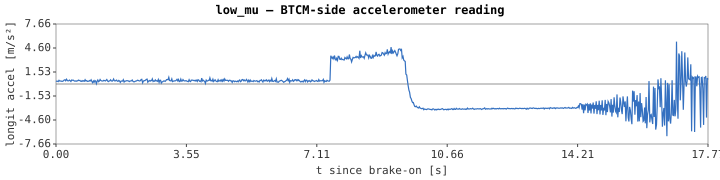

## `mu_jump`

### Setup

| Field | Value |
|---|---|
| Surface | asphalt for 100 m, then ice (μ jumps from 0.9 → 0.08) |
| Approach | throttle to ≥ 20 m/s on asphalt, throttle off, full brake — typically straddles or has just crossed onto ice when brake hits |
| Brake fires | scenario t = 6 s |
| Validates | algorithm must adapt as friction drops mid-event |

### Result summary (BTCM-on vs BTCM-off)

| Metric | BTCM-on | BTCM-off |
|---|---|---|
| Brake-on at | t = 7.76 s, v = 15.01 m/s | t = 7.76 s, v = 15.01 m/s |
| Stop result | didn't stop, v\_f = 4.10 m/s | didn't stop, v\_f = 3.65 m/s |
| FL events | 248 | 0 |
| FR events | 149 | 0 |
| Yaw drift over brake | -1.03° | -1.00° |

### Per-wheel slip statistics (BTCM-on)

| Wheel | peak | mean | time-locked |
|---|---:|---:|---:|
| FL | 1.000 | 0.415 | 8.9% |
| FR | 1.000 | 0.519 | 26.2% |
| RL | 0.567 | 0.016 | 0.0% |
| RR | 0.573 | 0.013 | 0.0% |

### Front ABS phase distribution during brake event (BTCM-on)

| Wheel | APPLY | HOLD | DUMP | stale | phase transitions |
|---|---:|---:|---:|---:|---:|
| FL | 5.9% | 32.8% | 50.9% | 10.4% | 248 |
| FR | 6.9% | 16.9% | 53.9% | 22.4% | 149 |

### Charts

**[▶ Animated top-down replay (open in browser)](abs_scenarios.charts/mu_jump_replay.html)** — watch the car drive through the brake event with per-wheel slip color-coded, surface patches drawn behind, and a scrubbable timeline.  Toggle BTCM-on / BTCM-off in the dropdown to A/B the same instant.

**Vehicle speed**

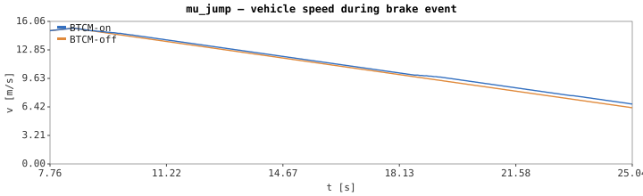

**Effective brake force at each axle.**  Front solid,
rear dashed.  Front line is `applied_front_brake` directly
(the post-ABS-modulation ratio fed to Chrono).  Rear line
is *derived* from `emb_cmd_lr/rr`: max(0, cmd) averaged
across L and R, because the CSV's `applied_rear_brake`
captures the *symmetric* driver-pedal command rather than
the per-wheel override that `ApplyRearEmbBrake` feeds into
Chrono.  BTCM-off rear is forced to 0 here — the EV1's
rear EMB has no hydraulic backup line, so when the
controller is out of the loop the rear free-rolls.

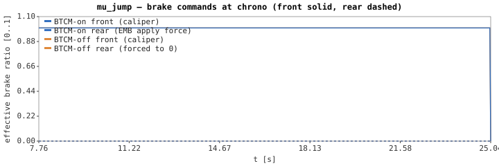

**Front ABS phase timeline (hydraulic axle).**  Discrete
APPLY/HOLD/DUMP solenoid bands.  See the rear EMB chart
just below for the *equivalent* rear-axle modulation —
same algorithm decisions, different actuator (continuous
motor command in [-1, +1] instead of solenoid phases).

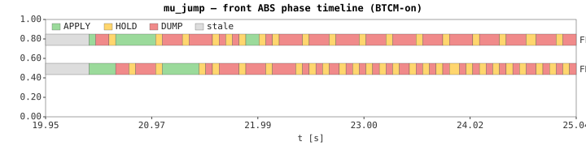

**Rear EMB motor command (electromechanical axle).** Continuous-valued analog of the front Gantt above. `+1` = motor pushing apply, `-1` = motor releasing the shoes, `~0` = hold position.

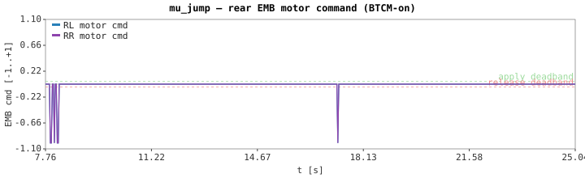

**Command vs actual actuator state.**  Solid lines are
commands sent to Chrono; dashed lines are the modeled
post-actuator-lag values (caliper hydraulic τ ≈ 50 ms
apply / 80 ms release; rear shoe rate-limited at ~3.33/s).
Useful for understanding why ABS modulation looks blunt
on the speed chart — the actuator lag smooths the rapid
HOLD↔DUMP cycling into a slower-changing pressure curve.

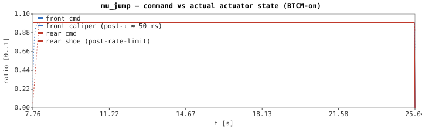

**Per-wheel ground speed** (chassis line + 4 wheel lines).  Gap = slip.

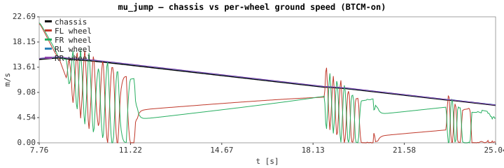

**Slip ratios.**  Threshold reference lines at 0.05 and
0.15 mark the algorithm's exit / enter slip thresholds.
Note the chassis-side slip values are *raw tire-contact*
data from Chrono's TMeasy model and look noisier than a
real ABS would see — production ABS heavily filters this
(typically a 10–30 ms low-pass), and our firmware's own
perception of slip (derived from tone-ring counts over
50 ms windows) is naturally smoother.  The peaks here
show what the *tire* is actually doing instant-to-
instant; the firmware's view is a window-average.

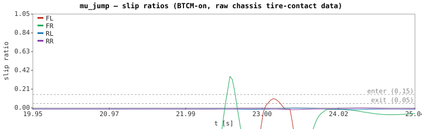

**Yaw rate.**  Positive = counter-clockwise rotation.

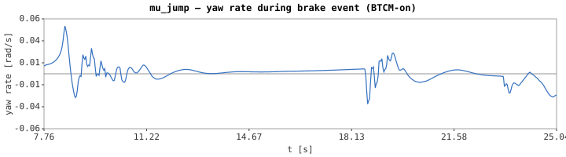

**BTCM firmware internal view.**  What the AVR's ABS
algorithm *thinks* is happening, sampled from the
firmware's `abs_controller_t` state via the host-side
`BTCM_CSV_LOG` snapshot.  Black = chassis truth (ev1sim);
blue = firmware's own `vehicle_speed_mps` reference;
colored = firmware's per-wheel ground speed (rps × tire
radius).  Time axis aligned to BTCM's brake-on event so
t=0 here matches t=0 in the chassis charts above.
Divergences between chassis truth and firmware view
show where the ABS algorithm's perception is wrong.

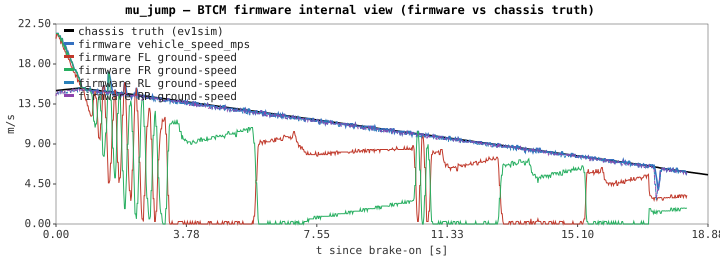

**BTCM-side accelerometer reading.**  The host bridge
publishes longitudinal accel onto the chassis bus and
pokes it into `g_host_sensors` even when the firmware's
ABS algorithm doesn't consume it (build-time gated by
`BTCM_USE_ACCELEROMETER`, default OFF to match original
EV1).  Useful for understanding what a second-gen ABS
would see if the firmware was rebuilt with the gate on.

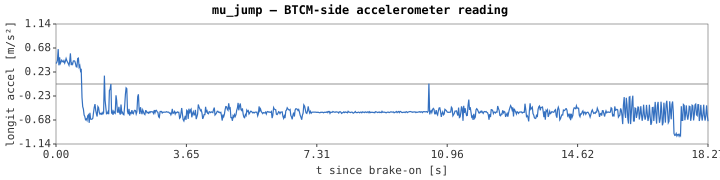

## `split_mu`

### Setup

| Field | Value |
|---|---|
| Surface | left side asphalt (μ = 0.9), right side ice (μ = 0.08) |
| Approach | throttle to ≥ 20 m/s straddling the seam, throttle off, full brake |
| Brake fires | scenario t = 12 s |
| Validates | yaw stability — without per-wheel ABS the asphalt-side wheels brake while ice-side skids, generating a yaw moment |

### Result summary (BTCM-on vs BTCM-off)

| Metric | BTCM-on | BTCM-off |
|---|---|---|
| Brake-on at | t = 12.02 s, v = 20.86 m/s | t = 12.02 s, v = 20.86 m/s |
| Stop result | 74.10 m / 7.01 s | 72.49 m / 6.53 s |
| FL events | 72 | 0 |
| FR events | 78 | 0 |
| Yaw drift over brake | +0.02° | +0.09° |

### Per-wheel slip statistics (BTCM-on)

| Wheel | peak | mean | time-locked |
|---|---:|---:|---:|
| FL | 0.654 | 0.079 | 0.0% |
| FR | 0.636 | 0.086 | 0.0% |
| RL | 0.760 | 0.094 | 0.0% |
| RR | 0.697 | 0.092 | 0.0% |

### Front ABS phase distribution during brake event (BTCM-on)

| Wheel | APPLY | HOLD | DUMP | stale | phase transitions |
|---|---:|---:|---:|---:|---:|
| FL | 32.4% | 8.1% | 32.7% | 26.8% | 157 |
| FR | 33.2% | 7.9% | 34.2% | 24.8% | 166 |

### Charts

**[▶ Animated top-down replay (open in browser)](abs_scenarios.charts/split_mu_replay.html)** — watch the car drive through the brake event with per-wheel slip color-coded, surface patches drawn behind, and a scrubbable timeline.  Toggle BTCM-on / BTCM-off in the dropdown to A/B the same instant.

**Vehicle speed**

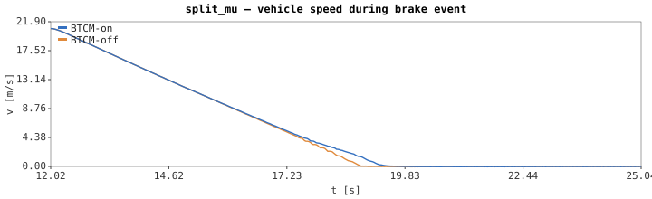

**Effective brake force at each axle.**  Front solid,
rear dashed.  Front line is `applied_front_brake` directly
(the post-ABS-modulation ratio fed to Chrono).  Rear line
is *derived* from `emb_cmd_lr/rr`: max(0, cmd) averaged
across L and R, because the CSV's `applied_rear_brake`
captures the *symmetric* driver-pedal command rather than
the per-wheel override that `ApplyRearEmbBrake` feeds into
Chrono.  BTCM-off rear is forced to 0 here — the EV1's
rear EMB has no hydraulic backup line, so when the
controller is out of the loop the rear free-rolls.

**Front ABS phase timeline (hydraulic axle).**  Discrete
APPLY/HOLD/DUMP solenoid bands.  See the rear EMB chart
just below for the *equivalent* rear-axle modulation —
same algorithm decisions, different actuator (continuous
motor command in [-1, +1] instead of solenoid phases).

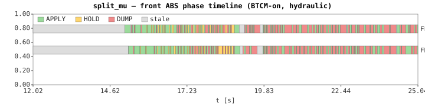

**Rear EMB motor command (electromechanical axle).** Continuous-valued analog of the front Gantt above. `+1` = motor pushing apply, `-1` = motor releasing the shoes, `~0` = hold position.

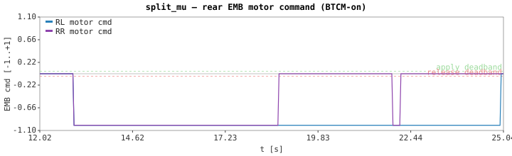

**Command vs actual actuator state.**  Solid lines are
commands sent to Chrono; dashed lines are the modeled
post-actuator-lag values (caliper hydraulic τ ≈ 50 ms
apply / 80 ms release; rear shoe rate-limited at ~3.33/s).
Useful for understanding why ABS modulation looks blunt
on the speed chart — the actuator lag smooths the rapid
HOLD↔DUMP cycling into a slower-changing pressure curve.

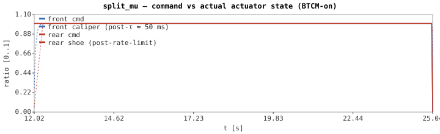

**Per-wheel ground speed** (chassis line + 4 wheel lines).  Gap = slip.

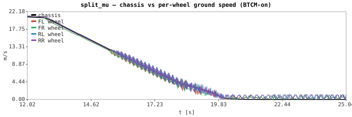

**Slip ratios.**  Threshold reference lines at 0.05 and
0.15 mark the algorithm's exit / enter slip thresholds.
Note the chassis-side slip values are *raw tire-contact*
data from Chrono's TMeasy model and look noisier than a
real ABS would see — production ABS heavily filters this
(typically a 10–30 ms low-pass), and our firmware's own
perception of slip (derived from tone-ring counts over
50 ms windows) is naturally smoother.  The peaks here
show what the *tire* is actually doing instant-to-
instant; the firmware's view is a window-average.

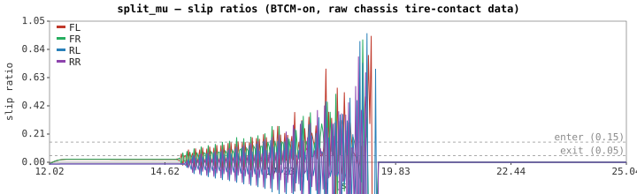

**Yaw rate.**  Positive = counter-clockwise rotation.

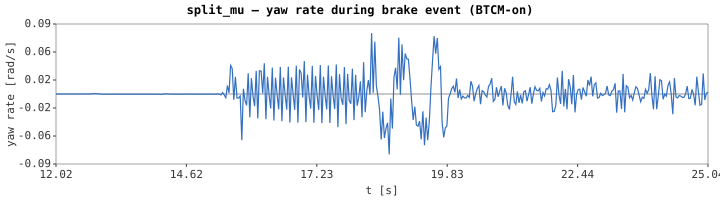

**BTCM firmware internal view.**  What the AVR's ABS
algorithm *thinks* is happening, sampled from the
firmware's `abs_controller_t` state via the host-side
`BTCM_CSV_LOG` snapshot.  Black = chassis truth (ev1sim);
blue = firmware's own `vehicle_speed_mps` reference;
colored = firmware's per-wheel ground speed (rps × tire
radius).  Time axis aligned to BTCM's brake-on event so
t=0 here matches t=0 in the chassis charts above.
Divergences between chassis truth and firmware view
show where the ABS algorithm's perception is wrong.

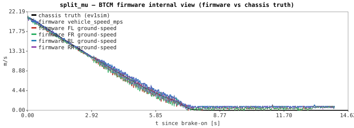

**BTCM-side accelerometer reading.**  The host bridge
publishes longitudinal accel onto the chassis bus and
pokes it into `g_host_sensors` even when the firmware's
ABS algorithm doesn't consume it (build-time gated by
`BTCM_USE_ACCELEROMETER`, default OFF to match original
EV1).  Useful for understanding what a second-gen ABS
would see if the firmware was rebuilt with the gate on.

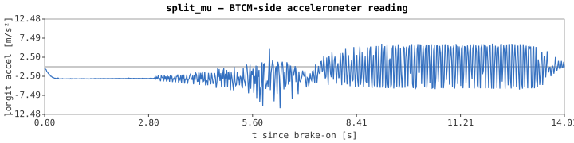

**Trajectory.**  pos_x vs pos_y over the brake event.

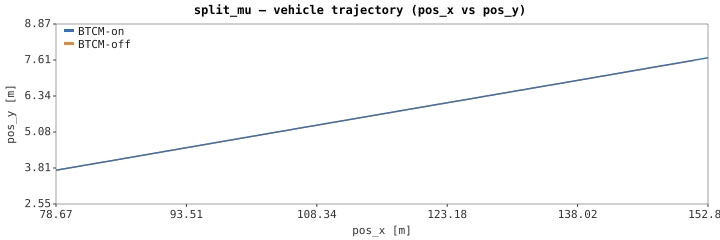

